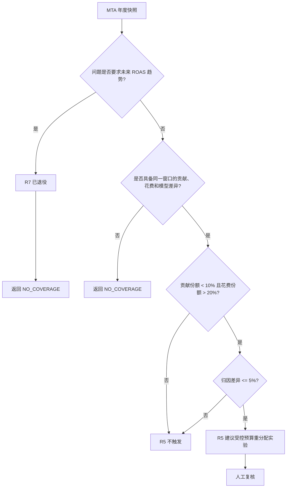

# Demo 规则决策流（v1.1-demo）

```mermaid
flowchart TD
  A[MTA 年度快照] --> B{问题是否要求未来 ROAS 趋势?}
  B -- 是 --> C[R7 已退役]
  C --> D[返回 NO_COVERAGE]
  B -- 否 --> E{是否具备同一窗口的贡献、花费和模型差异?}
  E -- 否 --> F[返回 NO_COVERAGE]
  E -- 是 --> G{贡献份额 < 10% 且花费份额 > 20%?}
  G -- 否 --> H[R5 不触发]
  G -- 是 --> I{归因差异 <= 5%?}
  I -- 否 --> H
  I -- 是 --> J[R5 建议受控预算重分配实验]
  J --> K[人工复核]
```

- R5 的三项输入都直接来自 MTA 或在同一报告窗口透明派生。
- R7 不再通过 Demo Mock 补足预测能力；接入真实的 campaign 级时间序列预测合同前，一律返回 `NO_COVERAGE`。
