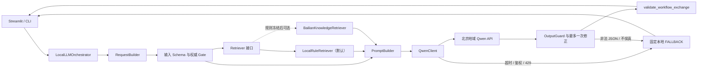

# Campaign Optimizer 本地优先大模型接入方案

**状态：** 当前权威方案

**日期：** 2026-08-03
**决策人：** 用户确认；Winston 架构更新；John 交付与协作更新

## 1. 决策摘要

Python 是唯一的工作流编排源。应用直接调用阿里云百炼北京地域的 Qwen 模型 API，不创建强制性的百炼 Workflow Application，也不依赖 APP ID。

百炼知识库不在当前关键路径。检索通过统一 `Retriever` 接口抽象：默认使用本地、确定性的规则仓库；规则和知识文档冻结后，可用百炼知识库实现进行独立 PoC，并通过 API 接入本地工作流。

## 2. 为什么改线

旧方案假设团队需要交付百炼 Workflow Application。现在已明确：老师提供百炼资源是为了在需要时使用，并不要求应用必须运行在百炼画布上。

因此继续维护百炼 Workflow 会造成不必要的双重编排、控制台资产管理、APP ID、额外延迟和平台锁定。本地 Python 更容易通过 Git、代码审查、pytest 和 CI 管理，也更适合当前尚未冻结规则卡的阶段。

## 3. 架构

## 4. 组件边界

### RequestBuilder

- 只从已验证的 `final_plan` 和 `ontology_review` 生成 `llm_request` 与 `llm_context`。
- 自动生成 `allowed_rule_ids`、`allowed_fact_ids` 和 `allowed_plan_item_ids`。
- 前端和模型不能自行填写白名单或版本。

### LocalLLMOrchestrator

- 是唯一工作流编排者。
- 决定 `initial_render` / `chat`、允许意图、检索、Prompt、最多一次内容修正及 fallback。
- 负责裁剪并隔离当前方案的对话历史。
- 不重新生成业务方案或本体裁决。

第一版使用普通 Python 函数和清晰状态对象，不引入 LangChain/LangGraph。只有出现至少三个需要持久状态、并行分支或复杂恢复的真实流程后，才重新评估工作流框架。

### Retriever

统一接口输入：`rule_ids + query + expected_version`。统一输出必须包含来源、版本、文档 ID 和检索方式。

- `LocalRuleRetriever`：默认实现；按规则 ID 从仓库权威公开投影中确定性读取。
- `BailianKnowledgeRetriever`：可选实现；仅在规则和公开文档冻结后启用，通过百炼知识检索 API 返回切片。
- 当前方案、动态评价、动态置信度和客户原始数据永远不进入知识库。

R1–R7 规模下，规则 ID 精确查询优先于向量检索。知识库主要面向未来的概念解释、FAQ、方法说明和非结构化长文档。

### QwenClient

只负责模型供应商适配：

- 北京地域 endpoint、模型名和 API Key；
- 超时、401/403、429、网络错误和响应解析；
- request ID、模型名、耗时、输入/输出 token 与脱敏错误码；
- 不判断 intent、规则、verdict 或用户权限。

### OutputGuard

- 校验输出 Schema、版本、intent、事实 ID、规则 ID、方案条目 ID、动作、数值、verdict 和 limitations。
- 生产入口继续使用现有 `validate_workflow_exchange()`；未来可新增更准确的 `validate_llm_exchange()` 名称，并保留兼容别名。
- 未通过校验的自然语言不得进入 UI。

### UI

- 首屏只展示确定性的结构化方案与本体评价，不等待 LLM。
- 用户点击“查看解释”时才调用模型。
- Qwen 不可用时展示固定 fallback，不影响核心页面。

## 5. 统一输出

继续保留 `OK / REFUSED / FALLBACK`：

- `OK`：生成成功并通过最终 Gate；
- `REFUSED`：问题越界或当前能力不支持；
- `FALLBACK`：内容、传输、鉴权、限流或解析失败。

模型输出必须符合 `campaign_optimizer/schemas/llm_workflow_output.schema.json`。文件名暂时保留以避免破坏已冻结测试，后续可在兼容迁移中重命名。

## 6. 知识库策略

### 当前

- 不创建正式百炼知识库。
- 等待本体团队冻结规则卡。
- 本地按规则 ID 读取公开规则投影。
- 使用合成 Fixture 测试 Prompt 和可信 Gate。

### 未来评估百炼知识库的触发条件

- 非结构化文档显著增多；
- 用户开始自然语言询问大量概念和方法；
- 关键词与规则 ID 查询无法满足召回；
- 团队希望使用托管切片、embedding、混合检索和 rerank；
- 固定检索测试集已经建立。

如果启用，百炼知识库只是派生索引；Git 中经审批的 JSON/Markdown 仍是唯一知识源。LocalLLMOrchestrator 通过 API 调用知识库，不需要百炼 Workflow Application。

## 7. 安全与数据边界

- Key 只存在于本地环境变量、ECS 环境变量或受控 Secret Store。
- 禁止将 Key、AccessKey、Cookie、客户数据、真实会话和完整敏感上下文写入仓库或日志。
- 浏览器不得直接调用 Qwen。
- 身份、`user_id + plan_id + review_id` 归属和会话真源在本地后端。
- 单元测试默认不访问网络；真实 API 测试必须显式启用并单独标记。

## 8. 实施阶段

| 阶段 | 工作 | 完成标准 |
|---|---|---|
| L0 架构改线 | 冻结本方案、组件边界、北京 endpoint、模型名、超时和 token 上限 | 团队确认 Python 是唯一编排源 |
| L1 契约复核 | 保留既有 Schema、Fixture 和 Gate，修复当前四项测试断言漂移 | 全部测试绿色 |
| L2 QwenClient | 实现同步调用、mock、request ID、usage、错误分类和密钥脱敏 | CLI 可用 Fixture 调 Qwen；错误固定降级 |
| L3 Retriever | 定义接口，实现 `LocalRuleRetriever`；只保留百炼适配器契约 | 指定规则只返回指定 ID/版本；空结果不猜测 |
| L4 本地编排 | 实现 initial render、chat、拒答、一次修正、历史裁剪和 OutputGuard | 无 Workflow/APP ID 完成纵向链路 |
| L5 Prompt/E2E | 固定问题集、注入、非法 JSON、数字篡改、断网测试 | 最小 Gate 全部达标 |
| L6 UI 联调 | 接入解释与问答，展示 provider/model/request ID/fallback 状态 | Qwen 失败不影响结构化页面 |
| L7 演示发布 | 先做本地可复现 Release；确需远程访问再决定 ECS | 至少两名成员从干净环境复现成功 |

## 9. 验收 Gate

- 固定集中的动作、数值、规则 ID、verdict 和 limitations 100% 保真。
- 未授权事实为 0；非法 JSON 为 0 条进入 UI。
- 请求 `context_id`、allowed intents、版本与输出完全绑定。
- Retriever 只返回请求规则 ID，来源与版本可追踪；空召回不得让模型猜测。
- timeout、401/403、429、断网和解析失败 100% 返回固定 `FALLBACK`。
- 日志不出现 Key、原始数据或完整上下文，只保留脱敏运行指标。
- 固定网络环境 P95 不超过 10 秒，并记录 token 用量。
- 本地测试和 GitHub CI 默认不产生模型调用费用。

## 10. 交付物

- 本地 `RequestBuilder`、`LocalLLMOrchestrator`、`QwenClient`、`Retriever` 与 `OutputGuard`；
- 五份 Schema、合成 Fixture、Prompt、拒答集和评测集；
- 本地 Qwen smoke test 与完整 E2E 记录；
- GitHub README、安装说明、架构文档、进度和安全说明；
- 可复现 Release；
- 可选的 `BailianKnowledgeRetriever` PoC；
- 可选 ECS 部署说明。

以下不再是强制交付物：百炼 Workflow Application、APP ID、Workflow DSL 和正式百炼知识库。

## 11. 决策优先级

本文件取代 `_bmad-output/planning-artifacts/llm-integration-plan-a.md` 中“必须使用百炼 Workflow”的决策。旧文件保留为历史设计证据；若发生冲突，以本文件及后续明确的导师/用户决策为准。
## 12. General Review hardening (authoritative)

### Intent ownership and hybrid Router

`LocalLLMOrchestrator.run()` is chat-only and accepts `question` plus an authenticated server `SessionContext`; it does not accept caller-owned `mode`, `intent`, assistant history, or `history_context_id`. Backend initial rendering uses `render_initial(plan, review)`, which accepts no question and fixes both `initial_render` and `EXPLAIN_REVIEW`. Chat routing gives hard prohibitions priority, then permits only fully anchored explanation templates containing an explanation verb and explicit object; compound commands and extra purposes are refused. Ambiguous questions go to an injectable `RouterClassifier`. Missing classifiers, classifier failures, invalid confidence, and confidence below the configured threshold fail closed to `OUT_OF_SCOPE`/fixed `REFUSED`. Keyword rules are not represented as complete natural-language understanding.

`run_legacy(..., untrusted_intent=...)` is a deprecated migration shim. The supplied value is ignored and never enters routing or metadata. `RequestBuilder` is an internal backend boundary; its `resolved_intent` and `server_chat_history` parameters must not be exposed as HTTP/UI inputs.

### Server-owned session isolation

Chat history is owned by a `SessionStore` and keyed by the exact binding `(tenant_id, user_id, session_id, plan_id, review_id, context_id)`. Tenant/user identity must come from authenticated server context; plan, review, and context identifiers are derived from validated backend objects. The local `InMemorySessionStore` serializes operations with a lock, lazily expires records by TTL, is the sole history pair/count/character trimming authority, and appends only validated `OK` exchanges. `RequestBuilder` validates strict user/assistant alternation without applying a second budget. Read failure returns safe fixed `FALLBACK` with `persistence_status=READ_FAILED`; write failure is explicitly reported as `WRITE_FAILED`. Future database implementations must preserve the same binding and atomicity rules. Prompt or history content must never be written to logs.

### L6 capacity and identity gate

Before any production or shared deployment, an authenticated principal-to-`SessionContext` mapping, a bounded session capacity, and deterministic LRU eviction are mandatory L6 release gates. The current in-memory store is for local validation only; no database implementation is introduced by this change.
### Result envelope

Every path returns `OrchestrationResult`: deeply immutable validated workflow `output`, immutable metadata for every provider attempt, accumulated latency/usage, routed intent metadata, separate refusal/fallback reasons, and explicit persistence status. `REFUSED`, no-key, and `FALLBACK` use the same envelope. The object remains a read-only `Mapping`; `.as_envelope()` returns an independent deep copy so caller mutation cannot alter Gate state. Keys, prompts, full provider responses, and chat history are forbidden from the envelope.

### Dual-model revision target (not implemented in this change)

The future target is an Executor model followed by an independent Reviewer/Guard and, when allowed, a return to the Executor for revision. Reviewer self-calls and Reviewer-to-Reviewer loops are forbidden. Production default is `max_revision_rounds=1`. An explicit non-production experiment may configure at most `5`; exhaustion at any configured revision limit (from the production default through the experiment upper bound) must return fixed `FALLBACK`. The current implementation does not contain this Reviewer loop: `revision_rounds` is `0`, and the existing single content-format repair remains separately reported as `repair_attempts <= 1`.
