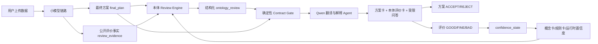

# Campaign Optimizer 本体 Review-only 权威架构 v2

**状态：当前权威设计**

**定版日期：2026-08-03**

**适用范围：当前 Demo**

本文件取代下列文档中与当前 Demo 冲突的设计：

- `_bmad-output/planning-artifacts/campaign-optimizer-ontology-architecture.md`
- `_bmad-output/planning-artifacts/ontology-build-plan-v1.md`
- `_bmad-output/planning-artifacts/mechanism-rule-concept-map.md`
- 旧 PRD/Epic 中“本体生成建议、自动执行、用户调整方案、反馈自动产生新规则”的当前阶段设计

旧文件保留为历史记录，不再作为实现依据。

## 1. 当前产品边界

当前工具只向用户展示：

1. 小模型链路生成的最终投放方案；
2. 本体对该最终方案逐条给出的评价；
3. 大模型对方案和评价的易懂翻译、解释与受限问答；
4. 方案的 `ACCEPT/REJECT`；
5. 本体评价的 `GOOD/FINE/BAD`。

当前 Demo 明确不做：

- 本体生成第二套预算方案；
- 本体审核每个小模型的中间结果；
- LLM 决定规则是否命中或裁决 SUPPORT/CONFLICT；
- 用户在界面修改预算并触发重新优化；
- 自动执行广告操作、自动回滚或自动审批；
- 用户反馈自动创建新规则；
- 向用户解释小模型内部公式、代码、训练过程或计算细节。

## 2. 总体架构



关键原则是：

> 小模型负责产生最终方案；本体规则引擎负责确定性Review；LLM负责表达和解释。

三层之间通过 JSON 契约交换结果，不互相代替。

## 3. 团队职责边界

| 团队 | 负责 | 不负责 |
|---|---|---|
| 小模型团队 | 数据处理、MTA/ROI/预测/优化、最终方案和公开结果字段 | 本体规则命中、自然语言解释 |
| 本体团队 | 概念卡、规则卡、事实标准化、Review Engine、评价JSON、置信度反馈状态 | Qwen API、Prompt、自然语言创作、小模型内部算法 |
| 大模型接入团队 | Qwen API、Agent编排、翻译、解释、受限问答、忠实性与安全测试 | 计算规则阈值、决定规则命中、生成本体 verdict |
| 后端/界面团队 | 上传触发、链路编排、页面展示、事件持久化、权限 | 修改规则语义或让前端自行拼评价 |

### 3.1 自动评价生成器归属

自动评价生成器属于本体团队，而不是大模型团队。

理由：

- 它执行的是结构化规则和数值比较，必须确定、可复现、可单元测试；
- 相同输入必须得到相同评价，不能受模型温度或措辞影响；
- Qwen 只能读取已经通过校验的 `ontology_review`，不能自行决定 verdict；
- 如果生成器由 Agent 完成，本体会重新变成不可审计的概率黑箱。

大模型团队的第一个输入边界是：

```text
final_plan + ontology_review + public_rule_context
```

而不是原始广告数据或未审核的小模型中间输出。

## 4. 本体资产现状

### 4.1 概念卡

当前资产清单固定为 24 张：

- base：8
- derived：9
- mta：4
- mock：3

权威清单：`campaign_optimizer/ontology/asset_manifest.json`。

### 4.2 规则卡

| 规则 | 状态 | 当前作用 |
|---|---|---|
| R1 | ACTIVE | 高ACoS、低CTR时评价增加预算方案 |
| R2 | ACTIVE | 曝光增长场景下评价保持预算方案 |
| R3 | ACTIVE | 高MTA ROAS时评价预算增加/减少动作 |
| R4 | ACTIVE | ROAS持续偏低时评价继续投放动作 |
| R5 | ACTIVE | 低贡献、高花费且归因差异可接受时评价预算动作 |
| R6 | ACTIVE | 低CVR场景的低置信评价与反馈演示 |
| R7 | RETIRED | 缺少真实预测模块，不能参与当前Review |

规则卡中的 `reference_action` 仅记录设计背景，不是可执行接口。实际评价只能由 `review_policy` 产生。

## 5. Review Engine

### 5.1 输入

- `final_plan`：小模型链路生成的完整最终方案；
- `review_evidence`：允许本体查看的公开事实；
- ACTIVE 规则卡；
- 当前规则的 `confidence_state`；
- 本体版本和事实来源元数据。

### 5.2 处理步骤

```text
1. 校验 final_plan 和 review_evidence Schema
2. 对每个 plan_item 筛选实体粒度和时间粒度适用的 ACTIVE 规则
3. 检查规则所需概念是否齐全
4. 执行 trigger_condition 的 all/any、比较运算和 baseline 引用
5. 规则命中后读取 review_policy
6. 将方案动作映射为 SUPPORT / CONFLICT / NOT_APPLICABLE
7. 缺少适用规则所需证据时生成 INSUFFICIENT_EVIDENCE
8. 没有任何规则覆盖该方案条目时生成 UNVERIFIED
9. 按保守优先级汇总 overall_verdict
10. 通过权威 Contract Gate 后发布 ontology_review
```

### 5.3 Verdict语义

| Verdict | 含义 |
|---|---|
| SUPPORT | 规则已命中，且方案动作属于规则支持动作 |
| CONFLICT | 规则已命中，且方案动作属于规则冲突动作 |
| NOT_APPLICABLE | 规则已命中，但该规则不评价当前动作 |
| INSUFFICIENT_EVIDENCE | 规则在当前实体/场景可能适用，但缺少必要公开事实或baseline |
| UNVERIFIED | 没有规则覆盖该方案条目，不得虚构规则、证据或置信度 |

保守汇总优先级为：

```text
CONFLICT > INSUFFICIENT_EVIDENCE > UNVERIFIED > NOT_APPLICABLE > SUPPORT
```

运行时置信度状态也是决定性评价的必要输入。缺少当前 `confidence_state`、状态非ACTIVE或低于最低可用阈值时，统一返回 `INSUFFICIENT_EVIDENCE`，不能回退为规则卡基础置信度。

## 6. 护栏为什么等待输入契约

护栏没有被删除或否定。G1、G2标记为 `PENDING_INPUT_CONTRACT`，因为旧条件无法由当前最终方案契约可靠求值：

- G1需要 `new_bid`，当前 `final_plan` 没有出价字段；
- G2需要“每日预算”，当前方案提供的是下一14天预算，直接比较会造成量纲错误。

如果继续保持 ACTIVE，会出现两种假象：要么永远无法触发，要么拿14天预算和每日最低预算错误比较。

护栏重新激活必须满足：

1. 小模型最终方案公开对应字段；
2. 字段的实体、时间和单位粒度明确；
3. 护栏条件可以由确定性引擎直接求值；
4. 增加正反例测试并经人工审批。

重新激活后，护栏也只产生 `CONFLICT` 或警告，不会阻止、修改或执行方案。

## 7. 反馈与迭代

### 7.1 方案反馈

用户只能选择 `ACCEPT/REJECT`。事件必须绑定：

- plan_id；
- plan_source_version；
- plan_hash；
- actor_id和时间。

方案反馈不直接改变规则置信度。

### 7.2 本体评价反馈

用户对每条评价选择 `GOOD/FINE/BAD`。反馈必须绑定具体的：

- review_id和review_item_id；
- plan_id和plan_item_id；
- rule_id和rule_version；
- 原始verdict。

反馈只更新独立的运行时 `confidence_state`，不修改静态规则卡，也不自动创建新规则。低于最低可用阈值或连续BAD达到门槛时，规则进入 `PENDING_HUMAN_REVIEW`。

新增规则只能由用户/本体维护人员按模板创建概念卡和规则卡，经过Schema、测试和PR审核后发布。

## 8. 大模型接入边界

Qwen侧可以保留职责单一的协作结构：

1. 确定性分诊：先由代码判断问题是否属于允许范围；
2. 翻译/解释Agent：把最终方案和本体评价整理为用户可读文本；
3. 评审Agent：检查是否忠实引用事实、规则、置信度和限制；
4. 有界回炉：只修正表达质量和证据引用，不得更改结构化方案或verdict。

允许问答范围：

- 方案内容、预算变化和周期；
- 本体评价是什么；
- 命中了哪条规则；
- 哪些公开事实满足或不满足规则；
- 规则置信度、版本和已知限制；
- 为什么当前无法评价某条方案。

拒绝范围：

- 小模型内部公式、代码、训练过程；
- 修改预算并重新运行优化；
- 开放式营销顾问问题；
- 让LLM推翻本体评价；
- 当前上下文之外的账户分析。

## 9. Demo首个纵向切片

首个可运行目标只支持 R5：

```text
MTA文件
→ 标准review_evidence
→ 最终预算方案
→ R5真实求值
→ ontology_review
→ Contract Gate
→ Qwen解释
→ 页面展示与反馈
```

首切片必须覆盖：

- 增加预算 → CONFLICT；
- 减少预算 → SUPPORT；
- 保持预算 → NOT_APPLICABLE；
- 缺任一必要事实 → INSUFFICIENT_EVIDENCE；
- 数值未满足R5 → R5不命中；
- 没有其他规则覆盖 → UNVERIFIED。

## 10. 发布与维护门禁

任何概念卡、规则卡、Schema或Review Engine修改必须通过：

```powershell
uv run python scripts/check_ontology_package.py --project-root .
uv run pytest -q
```

规则卡修改还必须：

- 追加版本历史；
- 更新资产manifest（如有增删）；
- 同步Fixture和测试；
- 标注Demo阈值与生产标定状态；
- 通过Pull Request交叉评审。

## 11. 当前开放项

1. 实现Review Engine自动生成 `ontology_review`；
2. 建立MTA字段到 `review_evidence` 的适配器；
3. 用R5完成第一个端到端自动Review；
4. 将confidence_state持久化到SQLite；
5. 编写本体维护指南；
6. 补建统一 `sprint-status.yaml`；
7. 待方案契约提供出价/每日预算字段后，将G1/G2从 `PENDING_INPUT_CONTRACT` 转入正式评审流程；
8. 待真实预测模块交付后，以新规则版本替代R7。
