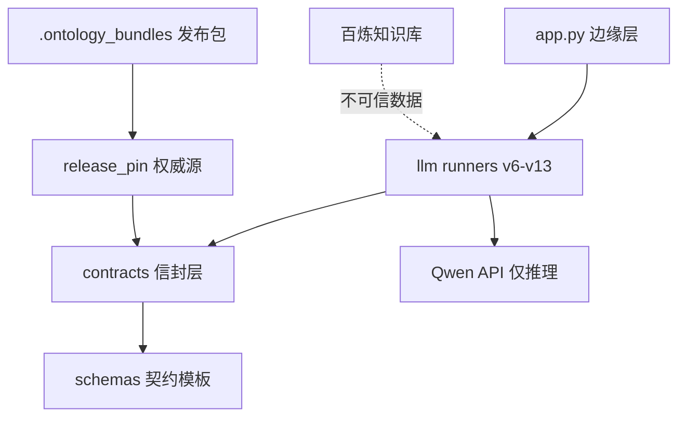
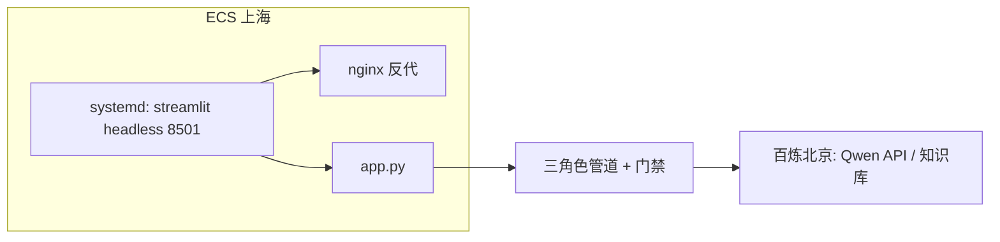

# Architecture Spine — LLM Integration (Campaign Optimizer Explainer)

## Design Paradigm

**Fail-closed gatekeeper pipeline**（pipes-and-filters 变体：每个 filter 都是可拒收的门，任一失败即安全回退）。概率组件（Qwen）只产出"建议"，确定性代码持有全部裁决权。层映射：

- `campaign_optimizer/contracts/` + `schemas/` — 信封层（契约与校验）
- `campaign_optimizer/llm/` — 角色层（Triage/Executor/Reviewer 适配器与 runner 谱系 v6–v13）
- `campaign_optimizer/ontology/` + `.ontology_bundles/` — 权威源层（发布包、release pin）
- 百炼知识库 — 补充检索层（不可信数据，永不入裁决路径）
- `app.py` — 边缘层（Streamlit，dry-run 默认）

## Invariants & Rules



依赖方向即规则：边缘→角色→信封→模板；权威源单向流入信封；知识库只能以数据身份流入角色层，永不流入信封/裁决。

### AD-1 — 混合 RAG 权威分割 [ADOPTED]

- **Binds:** 上下文组装（request_builder/retriever）、知识库发布
- **Prevents:** 检索结果被当权威、改写规则定义
- **Rule:** 权威规则上下文只走 release-pin 确定性投影（按 review 钉死 ID 取原文）；知识库结果是不可信数据，永不参与裁决；"查 R5 只返回 R5 或明确无结果"是硬门

### AD-2 — Fail-closed 信封 [ADOPTED]

- **Binds:** all
- **Prevents:** 门禁失败时放出不安全内容
- **Rule:** 任一门禁失败 → 固定文案安全回退；拒绝路径不回显不可信/伪造值；对外只暴露安全类别

### AD-3 — 发布身份钉死 [ADOPTED]

- **Binds:** 请求构建、知识库台账
- **Prevents:** 版本漂移、伪造发布包
- **Rule:** 校验根 = manifest `source_commit` 指名的冻结 bundle 目录（运行时门禁）；工作区根校验是独立的合并健康检查（O-6，待 MANIFEST_OK），不作运行时门禁。六字段身份 + package_checksum 在构造 provider 前校验，漂移即错误。manifest 匹配必须唯一，多匹配即 fail-closed，禁止首匹配语义。相似度阈值 0.60 的机械位置 = `kb_export/v1/manifest.json` 的 `similarity_threshold` 字段，重发布校验器强制读取、随发布配置走。每次发布记账（KB ID ↔ checksum ↔ 阈值）

### AD-4 — 不可变工件与版本盖章 [ADOPTED]

- **Binds:** 提示词、工具 schema、考卷、导出
- **Prevents:** 偷偷改质检标准/考题/知识
- **Rule:** 哈希钉死；任何变更 = 新版本 + 冻结考卷复验，不原地编辑。钉死清单含：提示词、工具 schema、决策信封（`schemas/reviewer_decision_v3.schema.json`、`triage_decision_v2.schema.json`——二者为工具 schema 的投影，单一所有权归 `llm/tools/`）、考卷、导出；信封与工具 schema 之间有一致性测试

### AD-5 — Function-Calling 唯一质检通道 [ADOPTED]

- **Binds:** Reviewer 适配器
- **Prevents:** 自由文本绕过结构约束
- **Rule:** content 必须为空、工具调用恰一次；本地权威 schema + binding（digest/allowlist/动作语义）高于 provider 返回

### AD-6 — 自动放行仅限"可逆且仅解释"输出（双维度门） [ADOPTED]

- **Binds:** Reviewer PASS→FINAL、路由放行
- **Prevents:** 把"置信度"与"可逆性"压缩成单一风险字段；对不可逆后果自动放行
- **Rule:** 放行成立依赖两个独立维度——可逆性：输出仅解释、不执行任何预算/动作（错了后果限于文字）；置信度：由冻结考卷逐案例双重确认度量，保持全绿放行门才有效。未来任何引入执行后果的功能必须重拆此决策，未经新 AD 不得自动放行

### AD-7 — 预算封顶 [ADOPTED]

- **Binds:** 所有 provider 调用
- **Prevents:** 成本失控
- **Rule:** 每候选每角色 ≤2、triage ≤1、总量账本封顶（公式以 max_provider_calls_v12 = 4*(rounds+1)+triage 为准，BudgetLedger 默认 25；评测 ledger = 2×案例数）；评测预算逐轮声明、用户批准

### AD-8 — 测量纪律 [ADOPTED]

- **Binds:** 任何影响模型行为的变更
- **Prevents:** 凭感觉迭代、盲重跑
- **Rule:** 冻结考卷 + 事先声明验收标准；单轮不足以为证；失败先经安全诊断归因再决定是否重跑

### AD-9 — 硬路由先于 Triage [ADOPTED]

- **Binds:** chat 入口
- **Prevents:** 复合/恶意提问消耗模型或进入管道
- **Rule:** 硬规则先判（零调用拒答）；无锚定才交 Triage；弃权/越界 → 安全回退

### AD-10 — 部署包络：ECS 直跑 [ADOPTED]

- **Binds:** 运维
- **Prevents:** 作者依赖型部署、密钥入库
- **Rule:** 不用 Docker（老师确认）；uv sync --frozen + systemd + nginx；env 经 EnvironmentFile 外置；冒烟必须显示发布身份且 release-pin 自校验通过（断言的是 bundle 根，见 AD-3）

### AD-11 — 本地优先编排线（显式豁免项） [ADOPTED]

- **Binds:** llm/orchestrator.py、session_store.py（FR28）
- **Prevents:** 编排线与主管道门禁尺度分叉；把 demo 级隔离误当生产隔离
- **Rule:** 编排线门禁与主管道等价（resolve_chat 复用 HybridIntentPolicy，硬路由先于模型）；SessionStore 是"无共享可变状态"约定的显式豁免项，边界 = 进程内、非持久（重启即失忆）、demo 级租户/用户隔离；demo 主路径不依赖编排线；任何把编排线升级为持久/生产隔离的需求须立新 AD

## Consistency Conventions

| Concern | Convention |
| --- | --- |
| 命名 | 角色模块逐版继承 `*_vN.py`，不原地改；考卷/导出目录带版本后缀 |
| 数据与格式 | 契约 JSON `schema_version: "1.0"`；sha256 十六进制；错误用稳定安全码（如 `REVIEWER_BINDING.*`、`INACTIVE_RULE`） |
| 状态 | 主管道无共享可变状态；每请求组装上下文；账本为进程内对象；SessionStore 为 AD-11 显式豁免（进程内、非持久、demo 级） |
| 错误 | 一律 fail-closed；不回显不可信值；UI 只显安全类别 |
| 配置 | `agent_roles.vN.json` 哈希钉死；环境变量仅经 systemd 注入 |

## Stack

| Name | Version |
| --- | --- |
| Python | 3.14 |
| uv | frozen lock（uv.lock） |
| pytest | 9.x |
| Streamlit | 1.61.x（lock 1.61.1） |
| jsonschema | 契约主体 Draft-07；决策信封（reviewer/triage）Draft 2020-12 |
| Qwen（triage/executor/reviewer） | qwen3.6-flash / qwen3.7-max / qwen3.7-plus |
| 百炼知识库 | text-embedding-v4 + qwen3-rerank，阈值 0.60 |
| 部署 | ECS Ubuntu 22.04 + systemd + nginx（无 Docker） |

## Structural Seed

```text
campaign_optimizer/
  contracts/        # 信封层：exchange/validation/authority
  schemas/          # 五份契约模板
  llm/              # 角色层：runner 谱系 v6-v13、release_pin、intent_policy、prompts/
  ontology/         # 权威源：rules/ concepts/ publication_manifest.json
  .ontology_bundles/ # 冻结发布包（校验和验证）
app.py              # 边缘层
kb_export/v1/       # 知识库导出快照
tests/fixtures/     # 冻结考卷/路由卷/检索卷/运行记录
```

> 此处为最小承载集（节选）；完整资产清单以 `campaign_optimizer/ontology/publication_manifest.json` 的 entries 为准。



## Capability → Architecture Map

| Capability / Area | Lives in | Governed by |
| --- | --- | --- |
| E1 契约与防篡改门禁 | contracts/、release_pin | AD-2, AD-3 |
| E2 三角色管道与预算 | llm/ runners、BudgetLedger | AD-5, AD-6, AD-7 |
| E3 可测量判断 | 评测脚本、冻结考卷 | AD-4, AD-8 |
| E4 权威知识与阅览室 | export 脚本、kb_export、台账 | AD-1, AD-3 |
| E5 演示与交接 | app.py、handoff、部署清单 | AD-10 |
| 路由安全 | intent_policy | AD-9 |
| FR28 本地优先编排线 | llm/orchestrator.py + session_store.py | AD-11 |

## Deferred

- Triage 模型/提示词升级（误路由已 fail-closed 兜底，独立评估项）
- R5 转正后的重发布触发（流程已定，事件未发生）
- canonical/Hannah 分支合并排序（团队决策；O-6 漂移待其复验）
- 知识库 API 接入应用（当前 KB 仅人工检索验收，未入运行时路径——引入前须新 AD 定其不可信边界）
- ECS 首跑验证（O-7；首跑即首验）
- ECS 续费决策（租期至 2026-09-12，约 09-05 前定续费/迁移；理由：部署配方已可交接，租约属商务事件非架构事件）
- 运行可观测性（结构化日志/指标）超出本脊高度，留待运维阶段（非目标声明）
